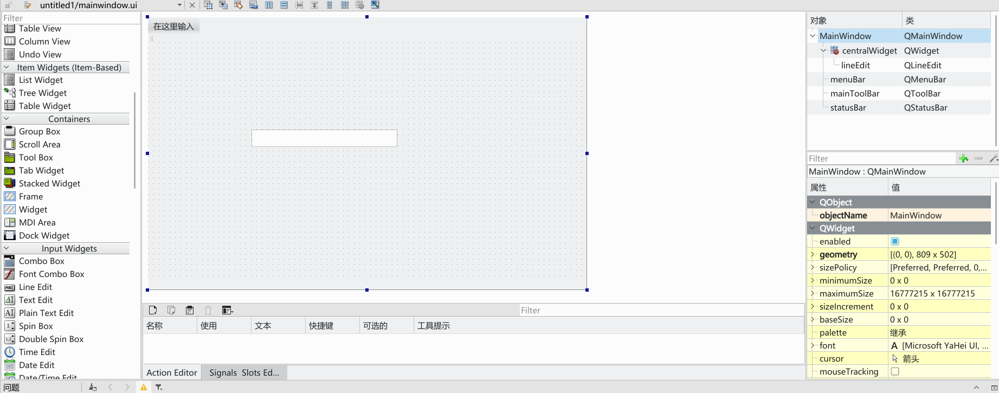
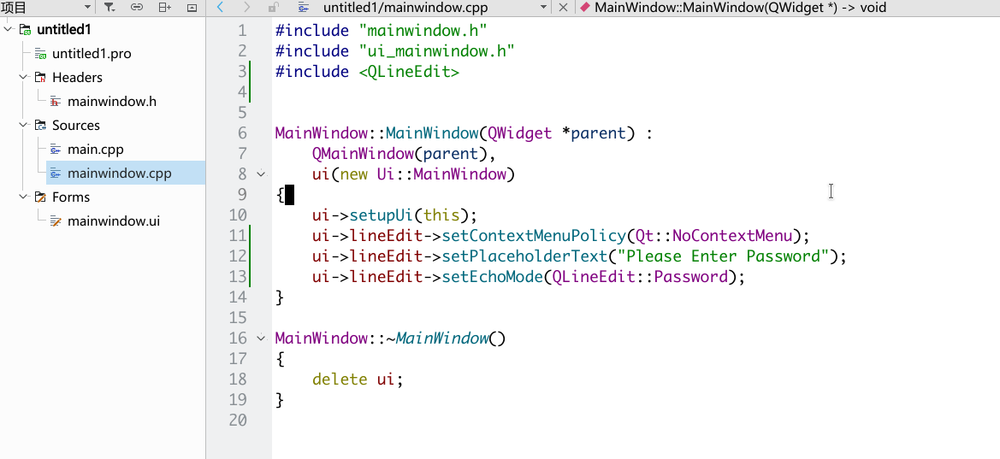
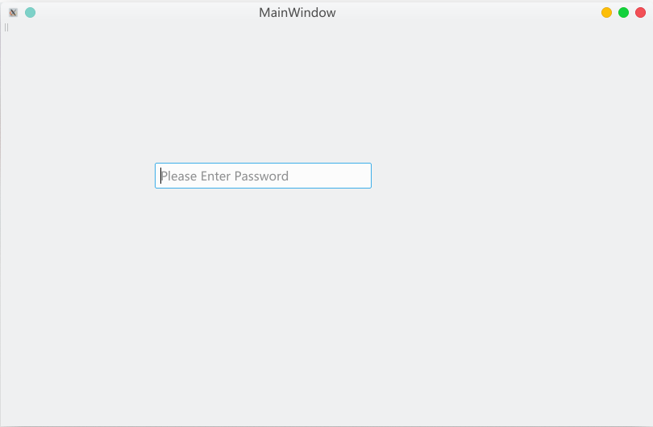
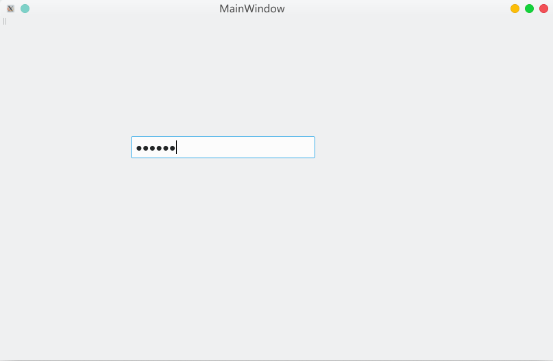

# StepOut Teamwork
## Name of Team: FastResearch
## Members of Team: LinZhichao, Wang BangZheng, XieTian

## Controls
### ScrollViewer
#### Reason:
> 因为我们将要做的Project是为科研工作者服务的。因此需要一个能够支持垂直滚动的控件来做到阅读论文、笔记以及浏览自己管理的命令行参数(一个页面显示不全)等。
#### Platform:
> IOS Xcode Swift
#### examples
选用控件: UIScorollView in Swift | ScrollViewer in UWP
>由于ios storyboard的方便性。因此我们在创建ios工程后 在控件区搜索UIScorollView

拖动到UI中

添加约束

添加view控件

修改view控件的高度以及添加约束

添加两个button

运行后的效果:\


### data binding
#### Reason:
> In our program, we need create some tools and papers.For this reason,if we use data-binding,it would help users know what the tools and papers are, and make it easy for the testing.
#### Platform:
>Wechat mini-program
#### Code:
```
<view class="main-map">
    <!--使用地图控件来展示数据绑定-->
    <map id="map-body" longitude="{{longitude}}" latitude="{{latitude}}" scale="{{scale}}"
        controls="{{controls}}" markers="{{markers}}"
        show-location   bindregionchange="regionchange"
        style="width:100%;height:{{height}}px">
    </map>
</view>
<!-- script部分代码节选 -->
<script>
import wepy from 'wepy';
import 'wepy-async-function';
 export default class extends wepy.app {
        data = {//data赋值这里不需要使用this.setData({}),在这里将需要的数据赋给初值。
         resData: [],
         scale: 18,
         latitude: '',
         longitude: '',
         markers: [],
         controls: [{}]
    }
    onLoad() {
        qqmapsdk = new QQMapWX({ //调用腾讯地图需要的sqk。
            key: 'SO6BZ-MGZW3-C563P-Y57QJ-Q3SOS-UDBF5'
        })
        wx.getLocation({
            //获得用户当前位置
            type: 'gcj02',//gcj20更精准
            success: (res) => {
                var latitude = res.latitude
                var longitude = res.longitude
                this.latitude = latitude
                this.longitude = longitude
                this.$apply()//在自定义的方法里面用this.之后，需要用this.$apply()来进行数据绑定。
                console.log(res)
            }
        })
    }
}
</script>
```
#### Tips
>微信小程序的数据绑定相对于uwp的我个人认为简化了很多，但是也有几点需要注意的，在不同函数中的数据绑定是不相同的，data中可以直接赋初值，比如我们用的经纬度，可以查询后直接设置，这样一打开就是你设置的经纬度；但methods里面只能放bindtap这类方法，所以你自己定义的其他方法，或者写在onshow里面，就必须得用this.$apply()。

## PasswordBox

### Reason:
>  在这个注重个人隐私的时代，密码对用户而言十分重要，而且密码功能也能防止某些别有用心的人恶意篡改用户数据，因此我们需要加入密码功能，而输入密码，显然需要一个不会明文显示密码的文本框。
### Platform:
> Qt on KDE

### examples
>Qt并没有直接的密码框控件，但是可以用Line Edit来实现

三行分别设置：无上下文菜单、占位提示内容、使用模糊字符代替实际输入的字符

没有输入密码时的效果
\
输入密码时的效果

