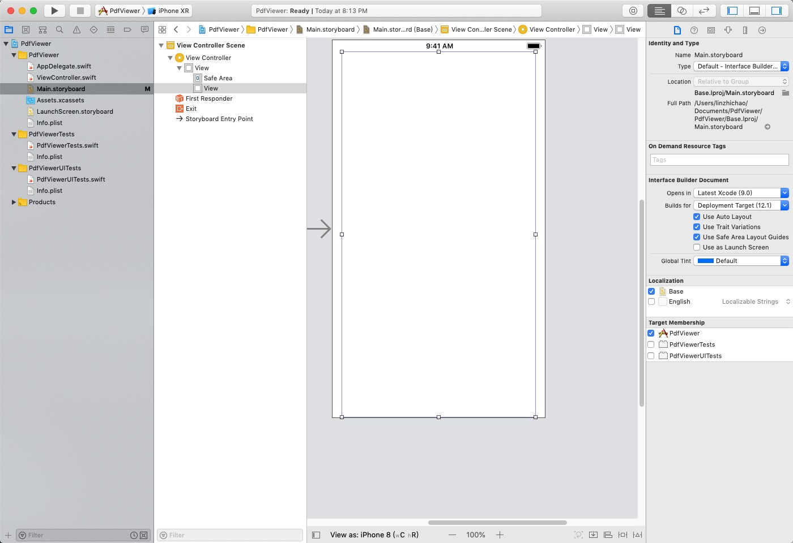
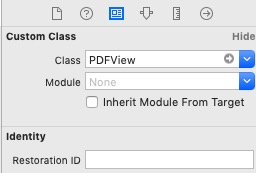
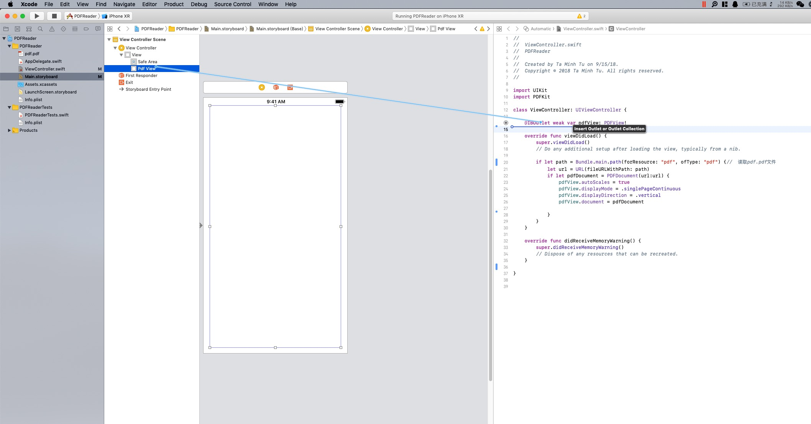
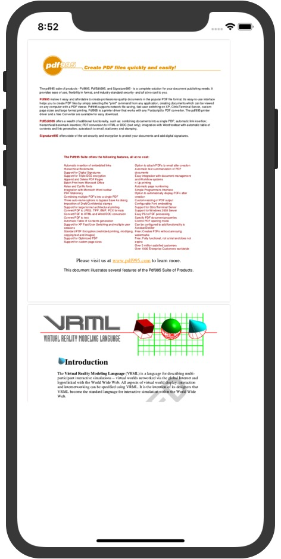

# StepOut Teamwork
## TeamName: FastResearch
## Members of Team: LinZhichao, Wang BangZheng, XieTian
## Technique:
> Open a PDF and Show It
## Reason:
> 因为我们的Project需要做到阅读论文,这就需要能通过一定的方法来展示pdf文件。因此接下来将要介绍如何在IOS开发平台上使用PDFKIT来展示pdf文件。
#### Platform:
> IOS Xcode Swift

#### Examples
##### In Uwp
在uwp中，我们要在一个UI中中显示pdf,我们需要用到在命名空间Windows.Data.Pdf的类与方法.
在官方提供的 [样例仓库](https://github.com/Microsoft/Windows-universal-samples/tree/master/Samples/PdfDocument)中提供了完整的使用办法。
下面给出官方demo中的核心代码:
```
using System;
using System.Threading.Tasks;
using Windows.Data.Pdf;
using Windows.Foundation;
using Windows.Storage;
using Windows.Storage.Pickers;
using Windows.Storage.Streams;
using Windows.UI.Xaml;
using Windows.UI.Xaml.Controls;
using Windows.UI.Xaml.Media.Imaging;

namespace SDKTemplate
{
    //demo中使用了navgation view因而需要新建一个页面叫做Scenario1_Render
    public sealed partial class Scenario1_Render : Page
    {
        private MainPage rootPage = MainPage.Current;
        private PdfDocument pdfDocument;

        const int WrongPassword = unchecked((int)0x8007052b); // HRESULT_FROM_WIN32(ERROR_WRONG_PASSWORD)
        const int GenericFail = unchecked((int)0x80004005);   // E_FAIL

        public Scenario1_Render()
        {
            this.InitializeComponent();
        }

        private async void LoadDocument()
        {
            LoadButton.IsEnabled = false;

            pdfDocument = null;
            Output.Source = null;
            PageNumberBox.Text = "1";
            RenderingPanel.Visibility = Visibility.Collapsed;

            var picker = new FileOpenPicker();
            picker.FileTypeFilter.Add(".pdf");
            StorageFile file = await picker.PickSingleFileAsync();
            if (file != null)
            {
                ProgressControl.Visibility = Visibility.Visible;
                try
                {
                    pdfDocument = await PdfDocument.LoadFromFileAsync(file, PasswordBox.Password);
                }
                catch (Exception ex)
                {
                    switch (ex.HResult)
                    {
                        case WrongPassword:
                            rootPage.NotifyUser("Document is password-protected and password is incorrect.", NotifyType.ErrorMessage);
                            break;

                        case GenericFail:
                            rootPage.NotifyUser("Document is not a valid PDF.", NotifyType.ErrorMessage);
                            break;

                        default:
                            // File I/O errors are reported as exceptions.
                            rootPage.NotifyUser(ex.Message, NotifyType.ErrorMessage);
                            break;
                    }
                }

                if (pdfDocument != null)
                {
                    RenderingPanel.Visibility = Visibility.Visible;
                    if (pdfDocument.IsPasswordProtected)
                    {
                        rootPage.NotifyUser("Document is password protected.", NotifyType.StatusMessage);
                    }
                    else
                    {
                        rootPage.NotifyUser("Document is not password protected.", NotifyType.StatusMessage);
                    }
                    PageCountText.Text = pdfDocument.PageCount.ToString();
                }
                ProgressControl.Visibility = Visibility.Collapsed;
            }
            LoadButton.IsEnabled = true;
        }

        private async void ViewPage()
        {
            rootPage.NotifyUser("", NotifyType.StatusMessage);

            uint pageNumber;
            if (!uint.TryParse(PageNumberBox.Text, out pageNumber) || (pageNumber < 1) || (pageNumber > pdfDocument.PageCount))
            {
                rootPage.NotifyUser("Invalid page number.", NotifyType.ErrorMessage);
                return;
            }

            Output.Source = null;
            ProgressControl.Visibility = Visibility.Visible;

            // Convert from 1-based page number to 0-based page index.
            uint pageIndex = pageNumber - 1;

            using (PdfPage page = pdfDocument.GetPage(pageIndex))
            {
                var stream = new InMemoryRandomAccessStream();
                switch (Options.SelectedIndex)
                {
                    // View actual size.
                    case 0:
                        await page.RenderToStreamAsync(stream);
                        break;

                    // View half size on beige background.
                    case 1:
                        var options1 = new PdfPageRenderOptions();
                        options1.BackgroundColor = Windows.UI.Colors.Beige;
                        options1.DestinationHeight = (uint)(page.Size.Height / 2);
                        options1.DestinationWidth = (uint)(page.Size.Width / 2);
                        await page.RenderToStreamAsync(stream, options1);
                        break;

                    // Crop to center.
                    case 2:
                        var options2 = new PdfPageRenderOptions();
                        var rect = page.Dimensions.TrimBox;
                        options2.SourceRect = new Rect(rect.X + rect.Width / 4, rect.Y + rect.Height / 4, rect.Width / 2, rect.Height / 2);
                        await page.RenderToStreamAsync(stream, options2);
                        break;
                }
                BitmapImage src = new BitmapImage();
                Output.Source = src;
                await src.SetSourceAsync(stream);
            }
            ProgressControl.Visibility = Visibility.Collapsed;
        }
    }
}
```

##### _In Swift_
下面给出在Swift出如何在一个content中显示pdf的样例:
1. 拖动view插件到View Controller中，设置好比例

2. 设置为 PDFView类 \

3. 创建pdfView在ViewController.swfit中,同时\
```
import PDFKit
```

4. 接着在ViewController.swfit输入以下代码(配有注释):
```
import UIKit
import PDFKit

class ViewController: UIViewController {

    @IBOutlet weak var pdfView: PDFView!
    
    override func viewDidLoad() {
        super.viewDidLoad()
        // Do any additional setup after loading the view, typically from a nib.
        
        if let path = Bundle.main.path(forResource: "pdf", ofType: "pdf") {//  读取pdf.pdf文件
            // 获取要打开文件的url
            let url = URL(fileURLWithPath: path)
            //读取该url对应的pdf文件并且设置属性
            if let pdfDocument = PDFDocument(url:url) {
                // 自动调整距离
                pdfView.autoScales = true
                // 单面y显示
                pdfView.displayMode = .singlePageContinuous
                // 设置显示方向
                pdfView.displayDirection = .vertical
                //  显示pdfDocument打开的pdf文件
                pdfView.document = pdfDocument
                
            }
        }
    }

    override func didReceiveMemoryWarning() {
        super.didReceiveMemoryWarning()
        // Dispose of any resources that can be recreated.
    }

}
 ```
5. 运行后显示效果为: \



### data binding
#### Reason:
> In our program, we need create some tools and papers.For this reason,if we use data-binding,it would help users know what the tools and papers are, and make it easy for the testing.
#### Platform:
>Wechat mini-program
#### Tips
>微信小程序的数据绑定相对于uwp的我个人认为简化了很多，但是也有几点需要注意的，在不同函数中的数据绑定是不相同的，data中可以直接赋初值，比如我们用的经纬度，可以查询后直接设置，这样一打开就是你设置的经纬度；但methods里面只能放bindtap这类方法，所以你自己定义的其他方法，或者写在onshow里面，就必须得用this.$apply()。
#### Code:
```
<view class="main-map">
    <!--使用地图控件来展示数据绑定-->
    <map id="map-body" longitude="{{longitude}}" latitude="{{latitude}}" scale="{{scale}}"
        controls="{{controls}}" markers="{{markers}}"
        show-location   bindregionchange="regionchange"
        style="width:100%;height:{{height}}px">
    </map>
</view>
<!-- script部分代码节选 -->
<script>
import wepy from 'wepy';
import 'wepy-async-function';
 export default class extends wepy.app {
        data = {//data赋值这里不需要使用this.setData({}),在这里将需要的数据赋给初值。
         resData: [],
         scale: 18,
         latitude: '',
         longitude: '',
         markers: [],
         controls: [{}]
    }
    onLoad() {
        qqmapsdk = new QQMapWX({ //调用腾讯地图需要的sqk。
            key: 'SO6BZ-MGZW3-C563P-Y57QJ-Q3SOS-UDBF5'
        })
        wx.getLocation({
            //获得用户当前位置
            type: 'gcj02',//gcj20更精准
            success: (res) => {
                var latitude = res.latitude
                var longitude = res.longitude
                this.latitude = latitude
                this.longitude = longitude
                this.$apply()//在自定义的方法里面用this.之后，需要用this.$apply()来进行数据绑定。
                console.log(res)

