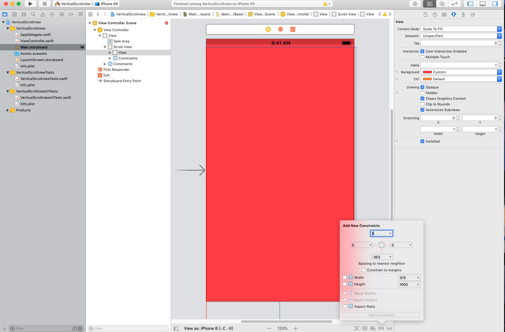

# FastReserach Team HomeWork
## ScrollViewer

### Reason:
> 因为我们将要做的Project是为科研工作者服务的。因此需要一个能够支持垂直滚动的控件来做到阅读论文、笔记以及浏览自己管理的命令行参数(一个页面显示不全)等。
### Platform:
> IOS by Swift

### examples
>由于ios storyboard的方便性。因此我们在创建ios工程后 在控件区搜索UIScorollView

拖动到UI中

添加约束

添加view控件

修改view控件的高度以及添加约束

添加两个button

运行后的效果:\

